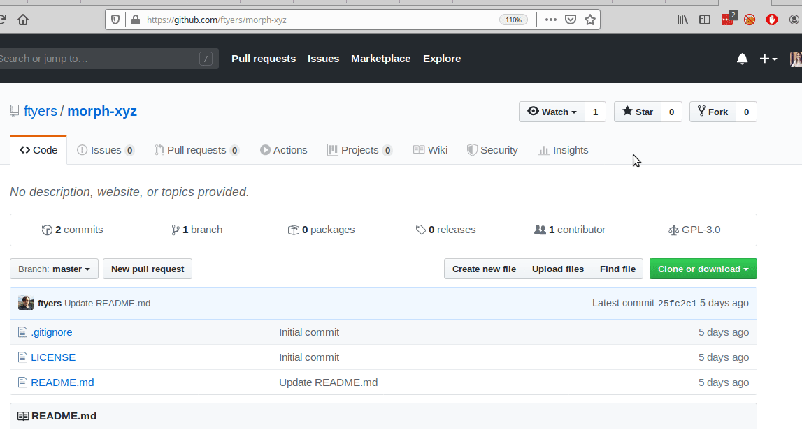

# Introduction


## Getting started

### On a Mac:

* Install [Homebrew](https://brew.sh/)
* Then run `brew install gnu-sed`
* And then `brew install python3`
* And then `brew install icu4c`

You will then need to add the install location to your path. Brew will tell you what to do
but if you forget you can find the install location using:

```
$ brew list icu4c | grep uconv
```

And then add the location of `uconv` to your `PATH` in your `~/.bash_profile`.

### On a machine running Windows:

#### Windows subsystem for Linux

Use these instructions, you may need to be administrator.

* [Instructions](https://docs.microsoft.com/en-us/windows/wsl/install-win10)

For the Linux platform, a good choice is Ubuntu or Debian

#### Virtual machine

* Install [VirtualBox](https://www.virtualbox.org/)
* Download the [disk image](http://tinodidriksen.com/uploads/Apertium-VirtualBox-20170911.zip)

You can follow the [screencast](https://www.youtube.com/watch?v=s05kfCcdFF4) to get installation
instructions.

* You will need to install a few things, e.g. `git`, you can do it with:

```
$ sudo apt-get update
$ sudo apt-get install git
```

## Installing HFST

### On a Mac:

```
http://apertium.projectjj.com/osx/nightly/
```
1. Download `hfst-latest.tar.bz2`
2. Extract the archive `tar-xjvf Download hfst-latest.tar.bz2`
3. Add `hfst/bin` to your path: 
    ```
    export PATH=$PATH:<path_to_hfst_bin>
    ```
4. Add path to `~/.bashrc` or `~/.bash_profile`

### On Windows/Linux:

```
sudo apt-get -f install apertium-all-dev
```

## Version control

### Set up a GitHub account

Follow [WikiHow](https://www.wikihow.com/Create-an-Account-on-GitHub) instructions. 

### Fork repository
[Link](https://github.com/ftyers/morph-xyz) to the repository.


### Quick guide to using `git`

You can clone your repository by doing:

```
$ git clone https://github.com/<USERNAME>/morph-xyz.git
```

Once you've made an edit, commit it using:

```
$ git commit -a -m "My commit message"
```

And push the changes using: 

```
$ git push
```

If you get a message from `git` asking you to identify yourself, do:

```
$ git config --global user.email "my@email.address"
$ git config --global user.name "My Name"
```

If you want to compare your version against the last pushed version, do:

```
$ git diff
```

And if you want to see if there are any changes that haven't yet been committed, do:

```
$ git status
```

## Glossary

- `~` tilde (tilde)
- `/` barra (forward slash)
- `|` placa (pipe)
- ``` ` ``` acento grave (back tick)
- `#` almohadilla (hash)
- `{}` llaves (curly brackets)
- `[]` corchetes (square brackets)
- `()` paréntesis (parentheses)
- `!` signo de admiración (exclamation mark)
- `<>` menor que, mayor que (less than, greater than)
- `\` barra inversa (back slash)
- `-` menos, guión (hyphen)
- `_` guión bajo (underscore)
- `^` circunflejo (circumflex, hat)


